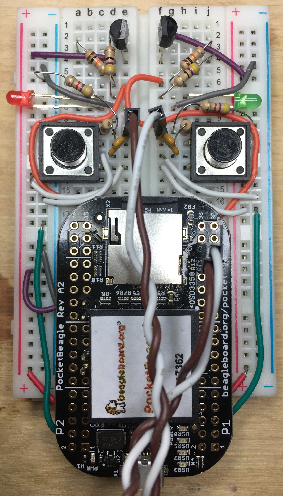

# beaglebone_experiments
Various projects to test the advanced capabilities of the beaglebone/pocket beagle, including

1) the programmable real-time units (PRUSS) and enhanced GPIOs, on UIO and remoteproc 

[PRU_video](https://www.youtube.com/watch?v=P8U2d4qgKzo)

2) real-time kernel and POSIX threads

3) loadable kernel modules

4) real-time control
