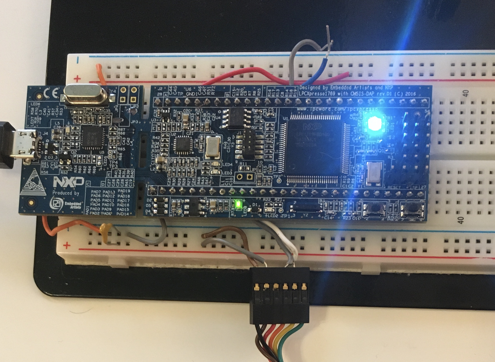
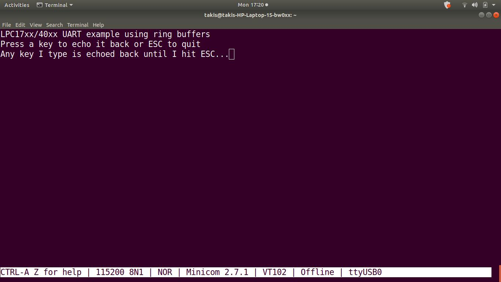

## UART transmission from LPC1769 working (checked with minicom on host machine)  

USB-TTL cable BLACK    goes to LPC1769 GROUND

USB-TTL cable BROWN  goes to LPC1769 3.3V (may not be necessary, but try it)

USB-TTL cable RED  is 5V from USB and so MUST NOT BE CONNECTED (leave floating)

USB-TTL cable ORANGE goes to LPC1769 J2-10

USB-TTL cable YELLOW goes to LPC1769 J2-9

USB-TTL cable GREEN is NOT CONNECTED

